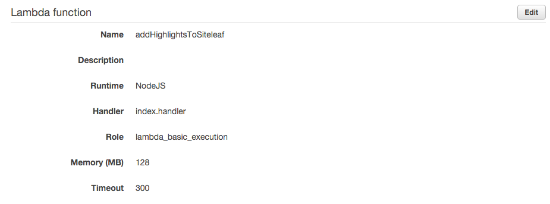
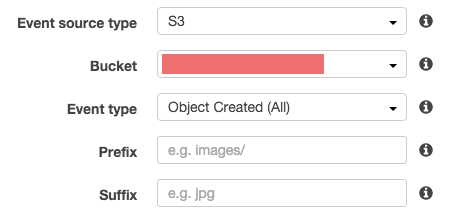

## How it works

1. SES receives the email
1. SES adds the email to S3
1. SES triggers the Lambda function
1. Lambda downloads the email from S3
1. Lambda pulls volume and highlights data from the email's body
1. Lambda adds any new data to Firestore

## Configuration

The Lambda function relies on the following environment variables. You'll need to set these to test locally:

* `KEY_PREFIX` - The directory within the bucket where the email objects can be found (SES only gives us the message ID, which is used for the object's name).
* `S3_BUCKET` - The bucket where the emails are added to
* `SERVICE_ACCOUNT` - Google Cloud Service Account JSON object

### Testing locally

1. Set the environment variables in a `.env` file within the package directory
1. Run `node_modules/.bin/nodenv index.js`

---

### Setting up AWS SES (and S3)

Setup AWS SES to store received email in an S3 bucket: http://docs.aws.amazon.com/ses/latest/DeveloperGuide/receiving-email-setting-up.html

There are a couple ways you can set this up, but here's what I did:

Through my domain registar I created a specific subdomain for receiving my highlight emails (eg my-highlights.example.com) and [verified my domain](http://docs.aws.amazon.com/ses/latest/DeveloperGuide/receiving-email-verification.html) using a TXT record.

In AWS SES I added my verified domain

and created a rule set that would send my emails to S3 (you can create the bucket in this step if one doesn't already exist)

### AWS Lambda

Create a new [AWS Lambda](https://aws.amazon.com/documentation/lambda/) function using the code in this directory (you can upload it as a Zip).

After your Lambda function is created, add an event source to it that listens for Object Created events in S3. Now your Lambda function will be called anytime a new object is added to the S3 bucket you setup to store your emails.

